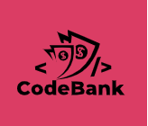
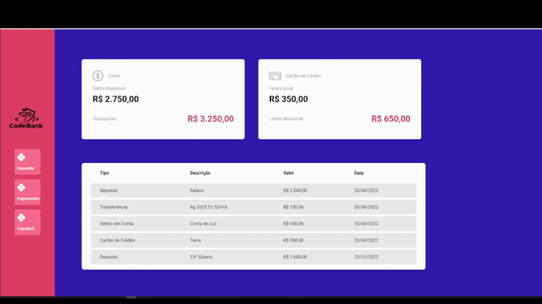

<h1 align="center">
  
</h1>

<h1 align="center">
  Code Bank
</h1>

<h2 align="center" >Descrição do Projeto</h2>
<p align="center">
   Code Bank é uma aplicação que tem a ideia de similar a principais transações de um conta de banco.
</p>

<h1 align="center">
  
</h1>

## :rocket: Tecnologias

Esse projeto foi desenvolvido com as seguintes tecnologias:

✔️ TypeScript

✔️ React

✔️ Styled-components

✔️ React-hooks

✔️ React-modal

✔️ Axios

✔️ Context-API


✔️ Json-Server

<h2>Pré-requisitos</h2>

Antes de começar, você vai precisar ter instalado em sua máquina as seguintes ferramentas:
[Git](https://git-scm.com) e [Node](https://nodejs.org/pt-br/).
Além disto é bom ter um editor para trabalhar com o código como [VSCode](https://code.visualstudio.com/).

# 👨‍💻 Rodando o Front End.

```bash
# Clone este repositório
$ git clone https://github.com/gabriel-assana/Code-bank/
# Acesse a pasta do projeto no terminal/cmd
$ cd Code-bank
# Logo após execute o comando abaixo para instalar todas as dependencias da aplicação.
$ npm install
# Proximo passa para iniciar a aplicação e digitar o comando abaixo no terminal.
$ npm start
```
# 👨‍💻 Rodando o Back End.

```bash
# Levantando o Backend
$ yarn server
``` 
